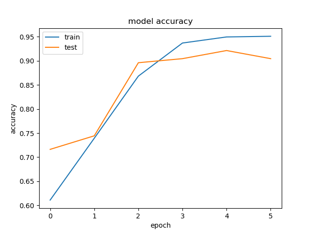
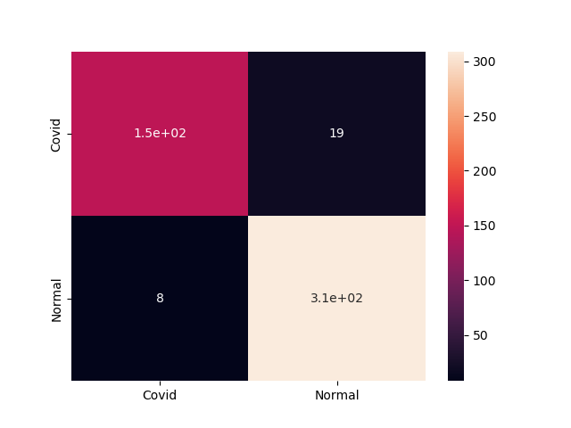

# MLops - Train
This is the pipeline of training and evaluating covid-19 x-ray detection system


<!-- TABLE OF CONTENTS -->
<details>
  <summary>Table of Contents</summary>
  <ol>
    <li>
      <a href="#about-the-project">About The Project</a>
      <ul>
        <li><a href="#built-with">Built With</a></li>
      </ul>
    </li>
    <li><a href="#pipelines">Pipelines</a>
      <ul>
        <li><a href="#training">Training</a></li>
        <li><a href="#evaluation">Evaluation</a></li>
      </ul> 
    </li>
    <li><a href="#conclusion">Conclusion</a></li>
  </ol>
</details>


<!-- ABOUT THE PROJECT -->
## About The Project
This project helps to identify people who got infected with covid-19 using their X-ray images. 

### Built With

* [Tensorflow](https://www.tensorflow.org/)
* [Pillow](https://pillow.readthedocs.io/)
* [Numpy](https://numpy.org/)


<!-- Pipelines -->
## Pipelines
Detailed description of training and evaluating will take a place in this section, each section will contain architecture, scripts and results.

### Training
- For training i used this [train.py](train.py) to train vanila CNN network with target of classification of x-ray image, The architecture of the network is:
```
Model: "sequential"
_________________________________________________________________
Layer (type)                 Output Shape              Param #   
=================================================================
conv_1 (Conv2D)              (None, 256, 256, 32)      320       
_________________________________________________________________
pool_1 (MaxPooling2D)        (None, 128, 128, 32)      0         
_________________________________________________________________
dropout (Dropout)            (None, 128, 128, 32)      0         
_________________________________________________________________
conv_2 (Conv2D)              (None, 128, 128, 64)      18496     
_________________________________________________________________
pool_2 (MaxPooling2D)        (None, 64, 64, 64)        0         
_________________________________________________________________
conv_3 (Conv2D)              (None, 64, 64, 128)       73856     
_________________________________________________________________
global_average_pooling2d (Gl (None, 128)               0         
_________________________________________________________________
dense_1 (Dense)              (None, 128)               16512     
_________________________________________________________________
dense_2 (Dense)              (None, 64)                8256      
_________________________________________________________________
Output (Dense)               (None, 1)                 65        
=================================================================
Total params: 117,505
Trainable params: 117,505
Non-trainable params: 0
```


- This network was trained with following parameters:
```
loss: Binary Cross Entropy
LR: 0.001
optimizer: Adam
batch size: 32
Epochs: 20 (Early stopping was used)
```

- Accuracy on training and validation:




### Evaluation
- Evaluation was done on test set (You can use this scripts for [prediction](predict.py)) and I got the following results:
```
Precision: 0.945395559724828
Recall: 0.9304954759251214
F1_score: 0.9372741018071855
Accuracy: 0.9442148760330579
```

- I also calculated confusion matrix for this model and got the following:




## Conclusion
Other experiments were conducted by finetuing pretrained models for this task and achieves almost 99%, but, these model were very large and the result are not that far from vanila CNN as you can see, the model achieves very good accuracy even when it is a vanila CNN.

You can find the final model here [model_0.944.h5](model_0.944.h5)
